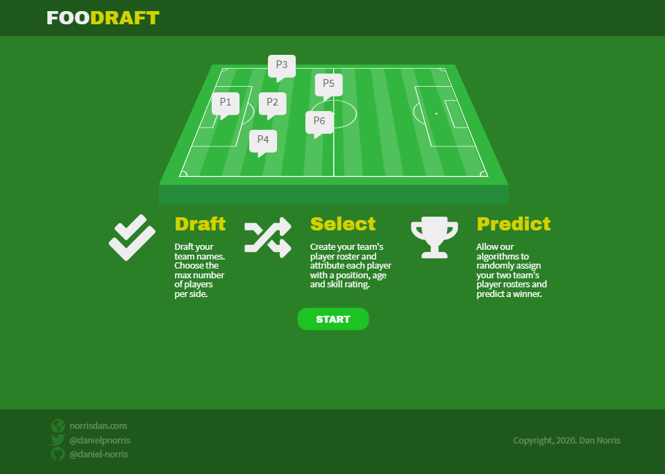

# FooDraft 	⚽

  



#### View live (here)[https://daniel-norris.github.io/football_app/#/].

Enabling you and friends to draft, select, randomise and predict the probability of winning a football game of team sizes between 1 - 9 players.

## Documentation

Detailed documentation is available on Confluence and it's recommended that you view the documentation there to enable you to view all of the Balsamiq wireframes.

[Docs - Confluence](https://dannorris.atlassian.net/l/c/sTC45Gyk)

Alternatively, `.pdf` and `.doc` is also available but is not optimised and are missing all wireframes.

[Docs - PDF](https://github.com/daniel-norris/football_app/blob/master/FooDraft.pdf)

[Docs - Doc](https://github.com/daniel-norris/football_app/blob/master/FooDraft.doc)

## Objective
Develop an app with an MVP that enables the user to randomly pick a 5-a-side football team from a list of 10 names.

Further stretch goals could be implemented if time allowed.

## Installation

**Installing the app locally**

    This guide assumes that you have node.js and npm installed. Installing these dependencies are out of scope for this guide but you can refer to the npm docs on how to install these dependencies here.

The app can be installed locally onto your machine by using the following steps.

First, clone the remote repository to your local machine and name the target directory.

```git clone git@github.com:daniel-norris/football_app.git <dir>```

Then cd into the project directory.

```cd <dir>```

Install the dependencies required for the app.

```npm i ```

Run the app.  When this runs you will redirected to http://localhost:3000/#/.

```npm start```

**Installing the API locally**

    This guide assumes that you have both PHP, Composer, Vagrant and MySQL installed. Installation is out of scope for this guide but you can refer to their docs on how to install.

First, clone the remote repository and name the target directory.

```git clone git@github.com:daniel-norris/football_api.git <dir>```

Change directory into folder.

```cd <dir>```

Run Composer to install dependencies.

```composer install```

Make a homestead.yaml file.

```vendor/bin/homestead make```

Copy the example environments variable file and create a new one.

```cp .env.example .env```

Then open the .env file and change the following fields according to your MySQL installation.

```nano .env```

```
DB_DATABASE=<DB name>
DB_USERNAME=<DB username>
DB_PASSWORD=<DB password>
```

Change `homestead.yaml` memory to `512`.

Then spin up a new Vagrant VM.

```vagrant up```

SSH into vagrant, generate a new key and migrate the tables.

```
vagrant ssh
cd code
run artisan key:generate
run artisan migrate
```

    If you choose to run both the app and API locally, then you will need to point the app away from AWS and towards your local Vagrant VM.

Point your local app towards the local instance of your API.

Create an .env file in your app directory using the instructions below.

**Mac OS**

You need to point the React app towards the appropriate URL. You can edit this in the .env file in the root directory.

```REACT_APP_API_URL=http://<laravel url here>/api/```

Then update your .axios file in the root directory.

```baseURL: process.env.REACT_APP_API_URL,```

**Win OS**
You need to point the React app towards the appropriate URL. You can edit this in the .env file in the root directory.

```REACT_APP_API_URL=http://localhost:8000/api/```

Then update your .axios file in the root directory.

```baseURL: process.env.REACT_APP_API_URL,```

### Releases Log

**21 Jun 2020 | v 0.1.0.**
- Initial release was planned on the Sunday before the week started. Ironically to avoid wasting any time but this plan would later be shelved over concerns about meeting time deadlines. You can review the original plan in the documentation above.

**22 Jun 2020 | v 0.2.0.**
- Production version plan is included here.
- Plan revised due to concerns about time constraints and database complexity and opted for a “slimmed” down version which I was confident I could deploy in time and with time to spare. Importantly, the free time provided contingency for unforeseen challenges which the earlier plan definitely would not have done.

**24 Jun 2020 | v 1.0.0.**
- App provides the user the ability to create teams and players and randomise functionality with an API.

**25 Jun 2020 | v 1.0.2.**
- Fixing cross-browser compatibility for custom form inputs including select picker.

**25 Jun 2020 | v 1.2.0.**
- Improved the original player field concept and implemented customisable marker feature.
- Marker now iterates over nth players per side.

**26 Jun 2020 | v 1.2.2.**
- Fixed a bug that was causing the timing of asynchronous GET /game and POST/players to render without specific data

**26 Jun 2020 | v 1.6.0.**
- Updated the API to include a GET /game/1 route for specific game data.
- User testing of app led to changes to layout and validation logic on form inputs for better UX.
- Added a tally feature to player creation.
- Removing the player attribute height from the app and database.
- Removed team kit feature from team creation.

**27 Jun 2020 | v 1.6.2.**
- Fixed bug causing footer to move off the bottom of the screen on some different aspect ratios.
- Improved unit testing across the board.
- Fixed deployment issue with Mockery dependency.

**TBC  | v 2.0.0.**
- Implement 3rd party API integration to enable user to pick premiership teams and players.
- Enable user to pick between creating a custom team and premiership teams above.
- Implement user authentication and authorisation.
- Provide user game history and win / loss history.
- Implement a style guide and documentation including props for the app using Storybook.
- Improve the UX / UI:
    -  Implement CSS transform and opacity keyframe animation to the main elements and field markers on app navigation for better visual experience.
    - Introduce A / B user testing.

**TBC  | v 3.0.0.**
- Monetise the app by either:
- Introducing affiliate links enabling users to place similar predictions with affiliated betting partners
- Introducing affiliate links enabling users to purchase merchandise from  affiliated premiership football clubs
- Introducing a subscription system…
